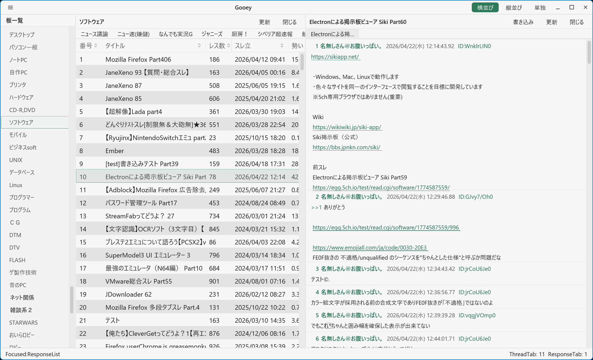

# gooey

> **これは実験目的のモックアップです。** 実用を想定した完成品ではありません。

GPU アクセラレーテッド 5ch ブラウザ。[gpui](https://github.com/zed-industries/zed/tree/main/crates/gpui) と [gpui-component](https://github.com/longbridge/gpui-component) を使って Rust で書かれています。

## スクリーンショット



## 機能

- **板一覧** — bbsmenu.json から全板を取得してカテゴリ表示
- **スレッド一覧** — subject.txt を読み込み、レス数・タイトルを表示
- **レス表示** — 仮想スクロールリストで高速描画
- **タブ管理** — 複数スレッドを同時に開ける。中クリックでタブを閉じる
- **差分取得** — HTTP Range Request を使った効率的な更新 (206 Partial Content 対応)
- **スクロール復元** — 更新後に表示位置をピクセル精度で復元。最下部を読んでいた場合は最下部へ戻る
- **新着マーカー** — 更新で追加されたレスに「更新」バッジを表示
- **内部タブナビ** — レス内の 5ch.io URL をクリックすると外部ブラウザではなく内部タブで開く
- **ファイルキャッシュ** — `%LOCALAPPDATA%\gooey\` にキャッシュを保存し、次回起動を高速化
- **セッション保存** — 開いていたスレッドや状態を `session.json` に保存・復元
- **カスタムテーマ** — `themes/gooey-custom-themes.json` をホットリロード対応
- **Shift_JIS デコード** — `encoding_rs` によるレス本文の文字コード変換

## データの保存場所

| データ | パス |
|--------|------|
| キャッシュ (board/thread/dat) | `%LOCALAPPDATA%\gooey\` |
| セッション (開いていたスレッド等) | `%LOCALAPPDATA%\gooey\session.json` |

## 動作環境

- Windows 10 / 11 (GPU ドライバが必要)
- Rust 1.85 以降 (edition 2024)

## ビルド & 実行

```bash
# デバッグビルド & 実行
cargo run

# リリースビルド
cargo build --release
./target/release/gooey
```

## 技術スタック

| 用途 | クレート |
|------|---------|
| GUI フレームワーク | `gpui` 0.2 |
| UI コンポーネント | `gpui-component` 0.5 |
| HTTP クライアント | `ureq` 2 |
| 文字コード変換 | `encoding_rs` |
| JSON シリアライズ | `serde_json` |
| 日付処理 | `chrono` |

## ライセンス

Apache License 2.0
